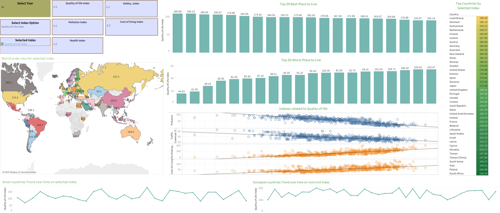

# Country-wise Quality of Life Overview
## Problem Statement & findings
The goal of this project is to gather and analyze quality-of-life data by country for 2025, sourced dynamically from the [Numbeo website](https://www.numbeo.com/quality-of-life/rankings_by_country.jsp?title=2025). This project involved scraping the data using Selenium, followed by processing and visualizing it through interactive dashboards in Tableau Public.
## Data Collection 
A total of 761 data points were collected, covering the following indices:
  - Quality of Life Index
  - Safety Index
  - Healthcare Index
  - Pollution Index
  - Purchasing Power Index
  - Cost of Living Index
  - Traffic Commute Time Index
  - Property Price to Income Ratio
  - Climate Index

The data spans the years 2016 to 2025, enabling a comparison of trends over time.

## **Goals of This Project**
1. Provide a comprehensive global perspective on various quality-of-life indices.  
2. Identify key factors influencing the `Quality of Life Index`.  
3. Compare different indices to determine the best country for living.  
4. Analyze patterns of quality-of-life-related indices across different continents.  
5. Find top countries according to selected indexe  

## The following key insights and analyses were derived using the data and presented through the Tableau Dashboard:
## Describing Tableau Dashboard:

### 1. **World-wide View for Selected Index**
A dynamic world map visualizing various indexes over time, labeled for clarity.  
- Users can explore details by selecting specific years, countries, and indexes.  
- Multiple countries and years can be selected, with the average index value displayed for multi-year selections.
---

### 2. **Top 20 Best Place to Live**
This visualization identifies the top 20 countries to live in.  
- Users can select single or multiple years to refine the results and adjust index weights for customized analysis.  
- By selecting different index option allows users to view and determine best country for chosen year(s).  

**Calculated Field Formula Used:**
```bash
([Quality of Life Index] * [Quality Idx]) + 
([Safety Index] * [Safety_idx]) +
([Health Care Index] * [Health_idx]) -
([Pollution Index] * [Pollution_idx]) -
([Cost of Living Index] * [Cost_of_living_Idx])
```
---
### 3. **Top 20 Places You May Not Want to Live**
This visualization identifies the 20 worst countries to live in using the same calculated field as the "Top 20 Best Places to Live" visualization.  
- Users can select single or multiple years and adjust index weights for customized analysis.  
- By selecting different index option allows users to view and determine best country for chosen year(s).

---

### 4. **Indexs related to Quality of life**
Analyze index patterns related to the `Quality of Life Index`.  
- Users can select specific year(s) to examine how other indexes interact with quality of life over time.
---

### 5. **Asian countries Trend over time on different Indexs**
This visualization displays trends of selected indexe over time for Asian countries.  
- Users can select year(s) and index to examine patterns and changes in index values.

---

### 6. **European Countries Trend Over Time on Different Indexes**
This visualization shows trends of selected indexe over time for European countries.  
- Users can select year(s) and index to examine patterns and changes in index values.

---

### 7. Top Countries by Selected Index   
This graph provides a **wide-scale analysis** of the **top 40 countries** based on the **average value** of the selected index for the chosen year(s). The goal is to offer insights into global rankings across key indicators, helping to understand how different nations perform in various domains. 
- Key Features  
  - **Comprehensive Rankings**  
  - **Yearly Comparisons** 
  - **Visual Representations**

## Findings:

### **For (Year = All)**  
#### Dashboard: *Country-wise Quality of Life Overview*    
  - The world map displays the average values of the selected index for all years.
---
  - Among **Asian countries**, the top-ranking nations, based on the average value of various indices, were:  
    - `Quality of Life Index`: **Oman**(`182.3`)  
    - `Cost of Living Index`: **Singapore** (`82.49`)  
    - `Purchasing Power Index`: **Qatar** (`123.31`)  
    - `Pollution Index`: **Lebanon** (`88.46`)  
    - `Healthcare Index`: **Taiwan** (`85.90`)
    - `Traffic Commute Time Index`:**Bangladesh**(`57.22`)
---
  - Among **European countries**, the top-ranking nations, based on the average value of various indices, were:  
    - `Quality of Life Index`: **Luxembourg** (`198.48`)  
    - `Cost of Living Index`: **Norway** (`96.60`)  
    - `Purchasing Power Index`: **Luxembourg** (`139.8`)  
    - `Pollution Index`: **North Macedonia** (`80.93`)  
    - `Healthcare Index`: **Austria** (`78.22`)  
    - `Traffic Commute Time Index`:**Russia**(`45.68`)
---
  We observed the following correlations with the `Quality of Life Index`:  
  - Positive correlations:  
    - `Purchasing Power Index` (**Strong**): `0.813728`  
    - `Cost of Living Index` (**Moderate**): `0.665700`  
  - Negative correlations:  
    - `Pollution Index` (**Strong**): `-0.853893`  
    - `Traffic Commute Time Index` (**Moderate**): `-0.675780`  
---
- **With All Indexes Maximized**    
  - The **best country to live in** was **Finland**, with an average `Quality of Life Index` value of `189.89`.  
  - The **worst country to live in** was **Nigeria**, where the average `Quality of Life Index` value of  `44.53`.  
--- 
Top Countries by Selected Indices  
Based on average index values, the highest-ranking countries across selected indices are:  
  - **Quality of Life Index** → **Luxembourg** (`198.48`)  
    - Recognized for its high living standards, economic stability, and strong infrastructure.  
  - **Safety Index** → **Qatar** (`85.63`)  
    - A nation with low crime rates, high security, and a stable environment.  
  - **Healthcare Index** → **Taiwan (China)** (`85.90`)  
    - Known for its efficient, high-quality, and accessible healthcare system.  
  - **Pollution Index** → **Lebanon** (`88.46`) *(Higher value = More pollution)*  
    - Indicates significant environmental and air quality challenges.  
  - **Purchasing Power Index** → **Luxembourg** (`139.78`)  
    - A reflection of high income levels and strong financial capacity of residents.  
  - **Cost of Living Index** → **Switzerland** (`120.00`)  
    - One of the most expensive places to live, driven by high wages and living expenses.  
  - **Traffic Commute Time Index** → **Nigeria** (`62.80`) *(Higher value = Longer commute time)*  
    - Reflects significant traffic congestion and long daily commutes. 
---

### All insights are presented in an interactive and user-friendly Tableau sheets and dashboards, which can be accessed here: [Interactive Dashboard on Tableau Public](https://public.tableau.com/app/profile/md.shoaib.akther.asif/viz/Country-wiseQualityofLifeOverview/QualityofLifeIndexbyCountryvisualizationproject)
**Preview of tableau dashboard:**  


### You can check the [Analysis file here](https://github.com/Shoaib-Akther-Asif/Country-wise-Quality-of-Life-Overview/blob/main/preprocessing.ipynb).

## Build From Sources and Run the Selenium Scraper

### Steps to Get Started:

1. **Clone the Repository, Set Up Environment, and Run the Scraper**
   - Clone the repository:
     ```bash
     git clone https://github.com/Shoaib-Akther-Asif/Country-wise-Quality-of-Life-Overview.git
     ```
   - Initialize and activate a virtual environment:
     ```bash
     virtualenv --no-site-packages venv
     source venv/bin/activate
     ```
   - Install the required dependencies:
     ```bash
     pip install -r requirements.txt
     ```
   - Download the compatible version of Chrome WebDriver from the [official website](https://chromedriver.chromium.org/downloads).  
   - Run the scraper:
     ```bash
     python Data_scrap/code1.py --chromedriver_path <path_to_chromedriver>
     ```

   After completing these steps, you will get a file named `quality_of_life_2016_to_2025.csv` containing data from 2016 to 2025 for all required fields.

2. **Alternatively**  
   You can check the [pre-scraped data here](https://github.com/Shoaib-Akther-Asif/Country-wise-Quality-of-Life-Overview/blob/main/data/scraped_data.csv).

# License  
This project is licensed under the **MIT License** – see the [LICENSE](LICENSE) file for details.  

# Contact  & Contributions
We welcome contributions! Feel free to fork the repository and submit a pull request.
For any inquiries or collaborations:   
- **GitHub:** [GitHub](https://github.com/Shoaib-Akther-Asif)  
- **LinkedIn:** [Linkedin](https://www.linkedin.com/in/shoaib-akther-asif/)  
- **Email:** shoaibaktherasif@gmail.com  

⭐ **Star this repo** if you find it useful!  

